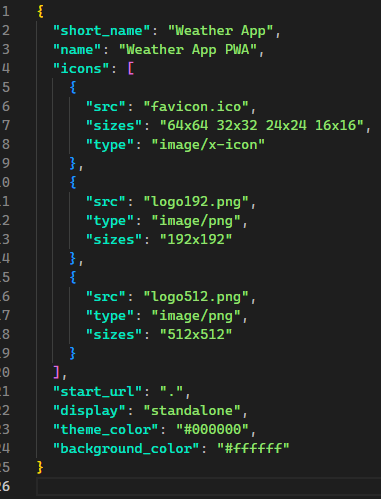
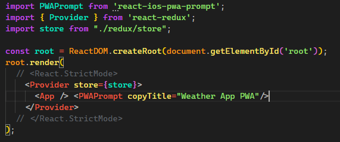
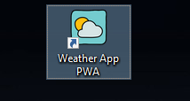

# weather app pwa

## [**GO TO THE APP**](https://weather-pwa-appreact.netlify.app/)

## Steps to develop a PWA (Progressive web app)

## Installation & Start
```javascript
npx create-react-app my-app --template cra-template-pwa
```

Once you've done this, develop your app. 

Once your app is ready, go to this file
```javascript
manifest.json
```



Modify the object keys as you want (short_name,name,icons). Then, go to this file:
```javascript
index.js
```
Change this method:
```javascript
serviceWorkerRegistration.unregister();
```
for this one:
```javascript
serviceWorkerRegistration.register();
```

Install this dependency:
```javascript
npm i react-ios-pwa-prompt
```

Go back to index.js and put this lines:
```javascript
import PWAPrompt from 'react-ios-pwa-prompt';
```
```javascript
<App /> <PWAPrompt copyTitle="App title"/>
```
The last one must be after your App component.





Now you are ready to run this command:
```javascript
npm run build
```

After that, everything is ready to deploy.
Visit [**Netlify**](https://app.netlify.com/) or any deployment site.
Drag your build folder into it to deploy your site.

Congrats, your PWA is ready to be used.





